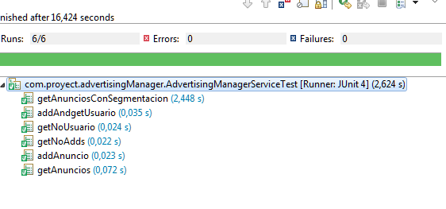

# TEMPLATE
1) Clonar proyecto
2) Copiar el proyecto a otra carpeta y borrar el .git folder
3) reemplazar "template" en todos lados por el nombre del nuevo proyecto.
4) Iniciar el nuevo repo con:

~~~~
- git init
~~~~

which initiates a new git repository in that directory.

- When you've done that, you need to register that new repo with a remote (where you'll upload -- push -- your files to), which in this case will be github. You'll get the correct URL from your repo on GitHub.

- git remote add origin https://github.com/[username]/[reponame].git

You need to add you existing files to your local commit:

- git add .   

this adds all the files
Then you need to make an initial commit, so you do:

- git commit -a -m "Initial commit" 

this stages your files locally for commit. 
they haven't actually been pushed yet

Now you've created a commit in your local repo, but not in the remote one. To put it on the remote, you do the second line you posted:

- git push -u origin --all
	
By Javier Martin Gonzalez

# Tecnologias Utilizadas:

- Java8: El core de la app
- SpringBoot: Api para dar manejo de aplicacion Rest, sencilla, rapida, ideal para el ejercicio en cuestion
- MongoDB: BD No relacional, embebida para este caso, queria darle una vuelta a las BD no relaciones y no defraudo
- Log4j: Logueo
- jUnit: Testing
- Lombok: Ahorro de lineas de configuracion con un par de anotations
- Maven: Librerias
- Swagger: Documentador de API endpoints.
- Jacoco: Cobertura y reportes

# Instrucciones para lanzar la aplicacion en localhost

1) Clonar el proyecto de github (https://github.com/xaavito/template)

2) Una vez clonado en un repo propio basta con ir a la carpeta template y desde la consola

					java -jar target/template-0.0.1-SNAPSHOT.jar

3) Acceder via explorador a:

							localhost:8080/add-anuncio

							localhost:8080/get-anuncios
							
							localhost:8080/get-anuncios/{id}
							
							localhost:8080/add-usuario

							localhost:8080/get-usuarios
							
							
# Tests

Conexion con Travis que ejecuta los tests y se puede ver en el Badge, Ademas adjutno esta captura de pantalla.

# Coverage

Cobertura de codigo a traves de los tests.

El reporte completo se puede encontrar en: [Reporte](https://github.com/xaavito/template/blob/master/coverage/Advertising%20Manager-jacoco-ut/index.html)

# Swagger

http://localhost:8080/swagger-ui.html#/